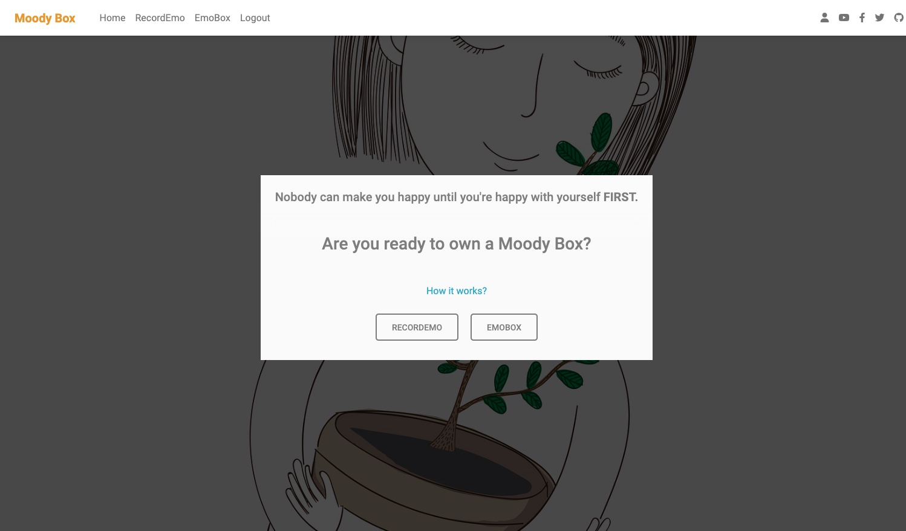
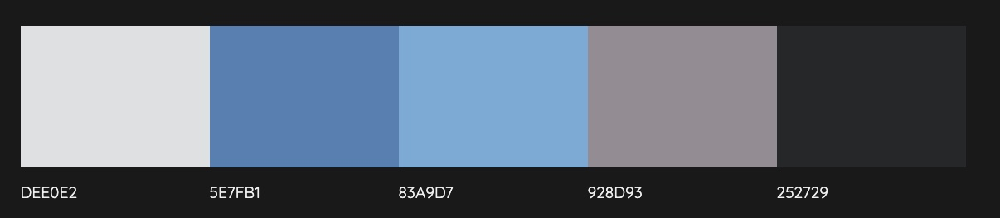

# [**Moody Box**](https://hdyd.herokuapp.com/)

## **Overview**

I always wonder how many days I feel happy and how many days I feel upset in a month.So I have a little notebook to track my emotions. I found it helps me to better manage my feelings. For example, I most likely try harder to calm myself down if I find myself upset most of the time. This is so true that ' Nobody can make you happy until you're happy with yourself FIRST. 'So~ here is how it works. Be honest with yourself and simply record your emotions by clicking RecordEmo and you can track all of your records by clicking EmoBox and that's it! Login and start from today!

## **Table of Contents**

- [**Moody Box**](#overview)
  - [**Overview**](#overview)
  - [**Table of Contents**](#table-of-contents)
    - [**1. What Is It?**](#1-what-is-it)
    - [**2. How to Achieve?**](#2-how-to-achieve)
    - [**3. Testing**](#3-testing)
    - [**4. Deployment**](#4-deployment)
    - [**5. Support**](#5-support)
    - [**6. Reference and Research**](#6-reference-and-research)

## **1. What Is It?**

- How Do You Do (Moody Box)
This is a website allows you to record your emotions and hope that eventually will help you become happier everyday.

[Back to the top](#overview)

## **2. How to Achieve?**

- ## **Strategy**

  - The target audience for 'Moody Box' are:

    - People who enjoy writing diary

    - People who like to record their moments

    - People who try to manage their emotions
  
  - These users will be looking for:

    - A website is simple and easy to use

    - A private place to write diary

    - A full record of their feelings

- ## **User Stories**

- ***Part 1 – An unauthenticated User***

  - As an Unauthenticated User, I can use this website sensibly, so that I feel comfortable using it.

  - As an Unauthenticated User, I can find a guideline to understand how to use this website, so that I don’t get confused.

  - As an Unauthenticated User, I can sign up to use the website, so that I can keep my data privately.

  - As an Unauthenticated User, I can login to my own page, so I can keep track of my history.

- ***Part 2 - An authenticated User***

  - As an Authenticated User, I want my records to be private, so that I feel safe about what I have recorded.

  - As an Authenticated User, I can record anything I want, so that I can use it as my diary.

  - As an Authenticated User, I can view all records I have, so that I can go back and review when I want.

  - As an Authenticated User, I can edit any records I have., so I organized it.
  
  - As an Authenticated User, I can delete any records I like, so that I can control what I like to keep.

- ***[Link to Github issue](https://github.com/CrankyCat-Loves-Coding/how-do-you-do/issues?q=is%3Aissue+is%3Aclosed)***

- ## **User View**

  - This is fairly simple. A home and a logo link will take a User back to the index page. An unauthenticated User has a chance to register or login the website. An authenticated User will be able to add emotions and review records.

    

  - At the How it works page, A User will explain how this website is going to work.

    

  - At the RecordEmo page, A User is able to select a date, a feeling and input some contents for record purpose.

    

  - At the EmoBox page, A User is able to review all individual's emo. Clicking details to modify or delete any emo.

    

  - At the Profile page (on the top right), A User is able to give himself a display name.

    

- ## **Coder View**

  - RecordEmo page is built based on CRUD - Create, Update and Delete method.

  - EmoBox page and is built based on CRUD - Read and Delete method.

  - Profile page and is built based on CRUD - Read and Update method.

  - Only an authenticated User is able to create, modify and delete data belonging to themselves.

  - Heroku was used for deployment.

  - AWS S3 was used for storing CSS and media.

  - DMB was used for styling.

  - Email verification with Google.

- ## **Design**

  - [Wireframes can be viewed here](https://github.com/CrankyCat-Loves-Coding/how-do-you-do/blob/main/media/doc/moody-box-wireframe.pdf)

  - Flowchart and Shema
    - UserProfile model assign an unique database to a user.

    - AddFeeling model link to the user profile to collect data accordingly, as well as to modify and delete assigned data.

   

  - Selected colors that represent peace and calm to build the website.

  

  - Selected Google Font Righteous

  

[Back to the top](#overview)

## 3. **Testing**

- Manual testing details can be found [here](https://github.com/CrankyCat-Loves-Coding/how-do-you-do/blob/main/mood/README.md).

- Technology Stack
  There is a list of tools or method had been used during the period of development:

  *Building methods*
  - [x] [Django-allauth](https://django-allauth.readthedocs.io/en/latest/installation.html)
  - [x] [Django-crispy-forms](https://django-crispy-forms.readthedocs.io/en/latest/)
  - [x] [AWS](https://aws.amazon.com/)
  - [x] [Bootstrap](https://getbootstrap.com/docs/4.3/getting-started/introduction/)
  - [x] [Heroku]( https://dashboard.heroku.com/apps)
  - [x] [pixabay - background image](https://pixabay.com/users/saydung89-18713596/?tab=most-relevant&pagi=3)
  - [x] [balsamiq](https://balsamiq.com/)
  - [x] [colormind](http://colormind.io/)
  - [x] [ezgif](http://ezgif.com/)
  - [x] [cloudinary](https://cloudinary.com/)

[Back to the top](#overview)

## 4. **Deployment**

- [Deployment details can be viewed here](https://github.com/CrankyCat-Loves-Coding/how-do-you-do/blob/main/media/doc/Moody-Box-Deployment.pdf)

- [Code Institute Python Essentials Template](https://github.com/Code-Institute-Org/python-essentials-template)

- The live link can be found here [link]( https://hdyd.herokuapp.com/)

[Back to the top](#overview)

## 5. **Support**

- Code Institute Tutor Assistance
- [Coder 凯歌响起](https://blog.csdn.net/a13554371686?type=ask)
- [Harry Dhillon](https://www.linkedin.com/in/harry-dhillon-299b321b3/)

[Back to the top](#overview)

## 6. **Reference and Research**

- Reference
  - [BugBytes](https://www.youtube.com/watch?v=MZwKoi0wu2Q&list=PL-2EBeDYMIbQSGbpvB59DJbf4Ox7hXPSU&ab_channel=BugBytes)
  - [jobin](https://github.com/williamtyn/jobin)
  - [heiwa-gallery](https://github.com/daisygunn/heiwa-gallery)
  - [boutique_ado](https://github.com/Code-Institute-Solutions/boutique_ado_v1)

[Back to the top](#overview)
