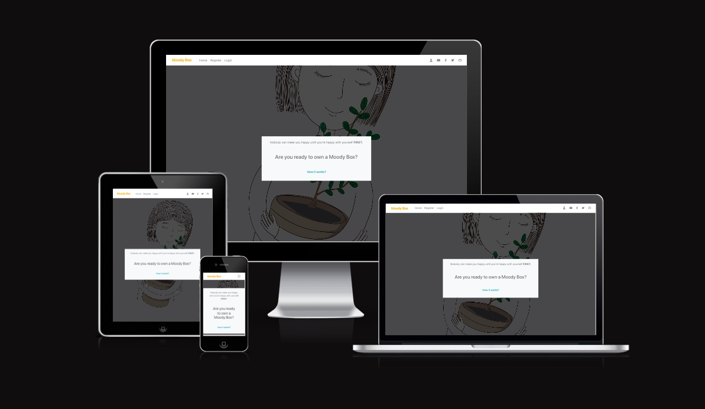

# [**CNEbroidery**](https://https://cnembroidery.herokuapp.com/)



## **Overview**

This is an e-commerce web application complete with product search and filter functionality. A live fully functional payment system. A full-featured authentication system including email confirmations and user profiles. And real-time notifications that guide the user's experience. The website was built in modern software development Such as Stripe, Amazon Web Services, Heroku, and more.

## **Table of Contents**

- [**CNEbroidery**](#overview)
  - [**Overview**](#overview)
  - [**Table of Contents**](#table-of-contents)
    - [**1. What Is It?**](#1-what-is-it)
    - [**2. How to Achieve?**](#2-how-to-achieve)
    - [**3. Testing and Launch**](#3-testing-and-launch)
    - [**4. Deployment**](#4-deployment)
    - [**5. Support**](#5-support)
    - [**6. Reference and Research**](#6-reference-and-research)

### **1. What Is It?**

- CNEbroidery
[Details of Ebroidery described on Wiki](https://en.wikipedia.org/wiki/Chinese_embroidery)

The name CNEbroidery is a combanation of 'CN' and 'Ebroidery', Chinese Ebroidery has been popular in China for thousands of years，most of the Chinese embroideries are made of silk. It is commonly made by hand, especially for very sophisticated design. It's considered as one of best gifts or collections. This website is built to introduct Chinese Ebroidery and sell high quality Chinese Ebroidery. 

[Back to the top](#overview)

### **2. How to Achieve?**

- **User View**

  

  - Nav bar
    - ***CNEbroidery***: clicking website name will be redirected back to the home page.
    - ***My account***: allowing users to login or sign up. This is built by using a popular pre-built package called Django-allauth. It's an open-source and believed to be secure and maintaind up-to-date. It's also easy to add more functionality to it.

    

    - ***Products***: users can access product page by clicking 'shop now' button or via nav product link. It contains all links for products and categories. There are three categories which are Decoration, Fashion and Offers.

    

    - ***Search engine and sorting products***: users are able to search from the entire site or sort by product size from small to big or sort by product price from low to high.
    - ***Cart (bag model)***: the color of cart icon will change to blue if users have added any items to cart. The total amount of shopping also available there. Clicking 'View Cart' will direct our users to cart detail page.

  - Footer
    - ***Subscribe***: users can enter an email to subscribe monthly newsletter to get exclusive offers and discount codes.
    - ***Facebook Social Link***: Facebook is used to build a community and deepening relationships with customers to encourage interest and customer loyalty.
    - ***Privacy Policy***: Privacy Policy to display to make sure that business complies with the law.

- My account
  - ***Sign up***:
    A confirmation email will be sent to registered email and a page instructing how to complete the registration is displayed. Once the user confirm registered email then personal profile will be created successfully.

    

  - ***Profile (UserProfile model)***:
    User has a personalized user profile. They can edit and save their information via the profile page. User can also check their order history via this page.

    

    


    - ***Products***: all products page contain product image, product name, product category, product size, product price. Click on 'Details' bottom will be redirected to product detail page which will show description of the product and a bottom to add to cart. 

    - ***Payment***: Stripe is used to collect payment. Order confirmation email will be sent after user completed payment. User will be able to view order summary at the check-out-success page.

    

- Product management
  - ***Add a product***:
  A user who is authenticated super user will be able to add, edit and remove an item. Adding a product can be access though "My Account" then "Product Management".

  - ***Edit and remove a product***:
  Editing and removing option will be display is user is authenticated.

  


- **Program flow chart**

    

[Back to the top](#overview)

### 3. **Testing and Launch**

- PEP8 validation

  - No errors or warnings were found when passing through the official PEP8 validator.

- Errors and Solution
  - ***Error 1***
    - ***Error message***: ERROR: Could not build wheels for backports.zoneinfo, which is required to install pyproject.toml-based projects
    - ***Solution***:
      - ```Heroku login -i``` (login to Heroku)
      - ```heroku stack:set heroku-20 -a <app name>```
      - runtime.txt (root directory, with the content of: python-3.8.14)
      - save, commit, push, deploy to heroku
      - [Article](https://devcenter.heroku.com/articles/heroku-20-stack)
  
  - ***Error 2***
    - ***Error message***: TypeError: expected str, bytes or os.PathLike object, not tuple
    - ***Solution***: ```MEDIA_ROOT = os.path.join(BASE_DIR, 'media')```, media_root was incorrectly set
    
  - ***Error 3***
    - ***Error message***: Class Product has no objects member
    - ***Solution***:
      - Fixed by adding ```objects = models.Manager()``` to Product.
      - That's not an error, it's just a warning from VSC. Django adds that property dynamically to all model classes (it uses a lot of magic under the hood), so the IDE doesn't know about it by looking at the class declaration, so it warns you about a possible error (it's not). objects is in fact a Manager instance that helps with querying the DB. If you really want to get rid of that warning you could go to all your models and add objects = models.Manager() Now, VSC will see the objects declared and will not complain about it again.
      - [Article](https://stackoverflow.com/questions/45135263/class-has-no-objects-member )

  - ***Error 4***
    - ***Error message***: django.db.migrations.exceptions.NodeNotFoundError: Migration checkout.0005_order_coupon dependencies reference nonexistent parent node ('coupons', '0003_alter_coupon_coupon_code_alter_coupon_discount_price')
    - ***Solution***:
      - basicly to solved this error is to completely remove your Django migrations and reset your database.
      - before doing that it is better to save database by using ```python3 manage.py dumpdata products.product > products_dump.json```,```python3 manage.py dumpdata products.category > categories_dump.json```. this can be skip if fixture is in place. This is how we got them.products is the app name, product is the model, products_dump.json is the name of the file we put the data in
      - Remove the all migrations files within your project. Go through each of your project apps' migration folders and remove everything inside, except the __init__.py file.
      - Drop the database. If you're using Heroku Postgres, the command for this is: ```heroku pg:reset DATABASE_URL```, need to login to Heroku ```Heroku login -i``` before doing that
      - Run the commands ```python3 manage.py makemigrations``` and ```python3 manage.py migrate``` to remake migrations and setup the new database
      - ```python3 manage.py loaddata categories```, ```python3 manage.py loaddata products``` to load data back

- Technology Stack
  There is a list of tools or method had been used during the period of development:

  *Building methods*
  - [x] [Django-allauth](https://django-allauth.readthedocs.io/en/latest/installation.html)
  - [x] [Django-crispy-forms](https://django-crispy-forms.readthedocs.io/en/latest/)
  - [x] [Django-countries](https://pypi.org/project/django-countries/)
  - [x] [pillow](https://pillow.readthedocs.io/en/stable/index.html)
  - [x] [cloudinary](https://cloudinary.com/)
  - [x] [Stripe](https://stripe.com/docs/api?lang=python)
  - [x] [AWS](https://aws.amazon.com/)
  - [x] [DMB](https://getbootstrap.com/docs/4.3/getting-started/introduction/)
  - [x] [Heroku]( https://dashboard.heroku.com/apps)
  - [x] [Privacy Policy Generator](https://www.privacypolicygenerator.info/ )
  - [x] [lucid](https://lucid.app/)

  **Other**
  - [x] [Responsive design](http://ami.responsivedesign.is/#)
  - [x] [Ezgif](https://ezgif.com/)

[Back to the top](#overview)

### 4. **Deployment**

- The site was deployed to [CNEmbroidery]( https://cnembroidery.herokuapp.com/) page. The steps to deploy are as follows:

- In the Heroku page, select ‘Create new app’

- Create app name and choose a region

- Navigate to the setting tab. Add Python and node.js buildpacks

- At the deploy section, connect to Github, search and link to CNEmbroidery repository.

- Scroll down to set up automatic deploys, it enables Heroku to rebuild the app every time push code to Github.

- The live link can be found here [link]( https://cnembroidery.herokuapp.com/)

[Back to the top](#overview)

### 5. **Support**

- Code Institute Tutor Assistance

  [Back to the top](#overview)

### 6. **Reference and Research**

- Reference
  - [x] [Wiki](https://www.wikipedia.org/)
  - [x] [Article 1](http://k.sina.com.cn/article_7059102645_p1a4c15bb500100hze9.html?from=cul )
  - [x] [README Basic writing and formatting syntax](https://docs.github.com/en/get-started/writing-on-github/getting-started-with-writing-and-formatting-on-github/basic-writing-and-formatting-syntax#uploading-assets)

[Back to the top](#overview)
